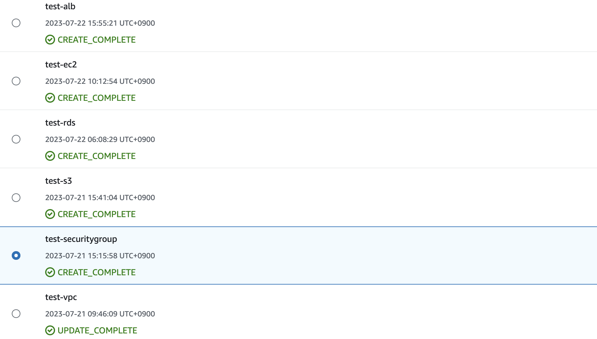

# 第10回課題: CloudFormationで環境構築

## 準備

VSコードのプラグインを使用して構文の自動補完を行いました。`setting.json`を通じて独自関数がエラーとして認識されないように設定しました。また、余計なスペースによってSyntaxエラーが発生するYAMLの特性を学び、適切なスペースの管理が重要であることを理解しました。

## テンプレート作成

テンプレート作成にあたり、依存関係や組み込関数の理解が難しかったです。

特に`ec2.yml`をアップロードしてスタックを作成する際に、AMIのIDがないというエラーに直面しました。最新のAmazonLinuxAMIを使用するために以下のように記述することが可能ですが、その場合にはAmazonLinux2023が作成されてしまう可能性があります。このため、AMIカタログから参照しました。

```yaml
Parameters:
  LatestAmiId:
    Type: 'AWS::SSM::Parameter::Value<AWS::EC2::Image::Id>'
    Default: '/aws/service/ami-amazon-linux-latest/amzn2-ami-hvm-x86_64-gp2'


スタックを再作成したものの、同じエラーが再発しました。原因を探ると、どうやら別のリージョンのIDを参照していたようです。これにより、リージョンによってIDが異なることを学びました。

## 反省点

これまでに課題５で構築した環境と全く同じ名前で新たに作成したため、同じ名前のVPCやセキュリティグループなどができてしまいました。これにより、どれがCloudFormationで作成したものなのか識別が難しくなってしまったという問題がありました。


