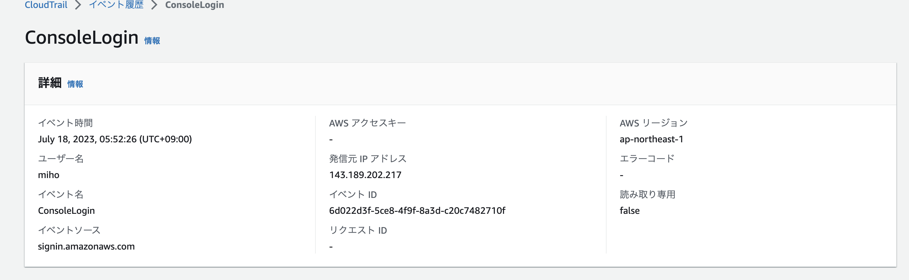
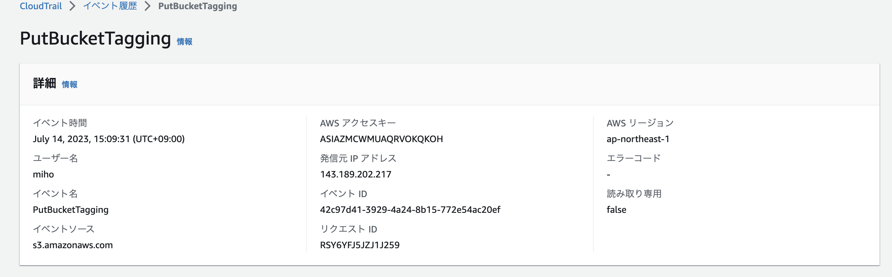
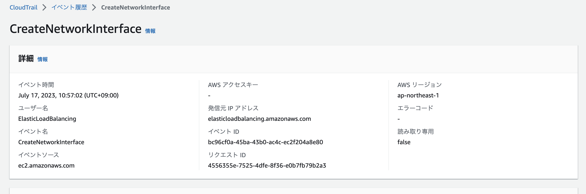
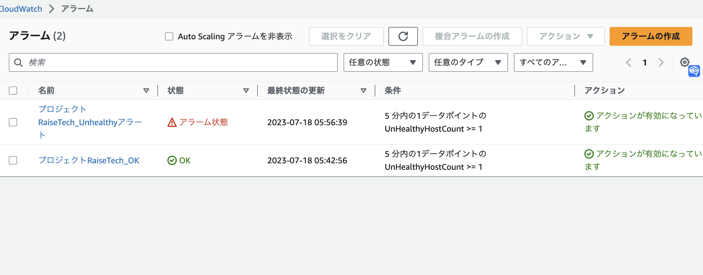
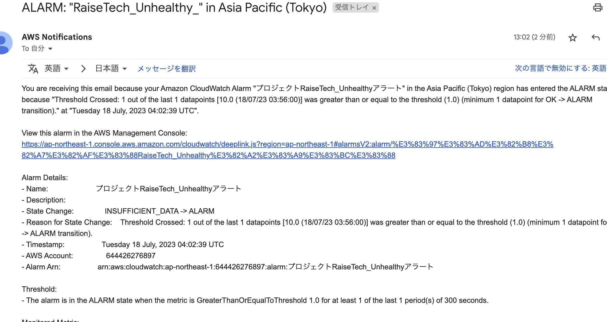
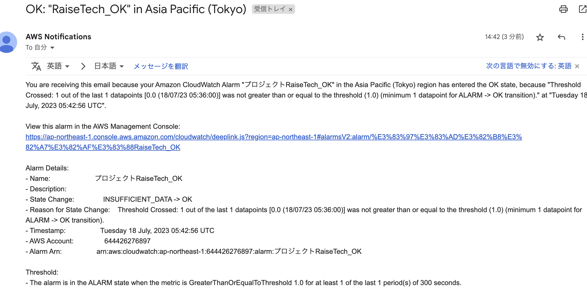
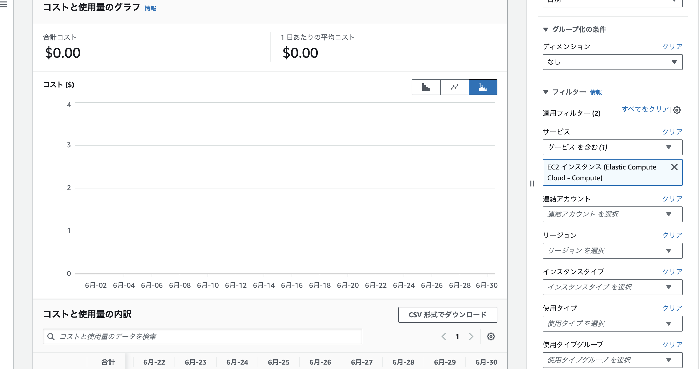

# 第６回課題

## 1. CloudTrail

### 1.1 イベント名：コンソールログイン

### 1.2 イベント名：S3タグ設定

### 1.3 イベント名：VPC内でネットワークインターフェースが作成

## 2. CloudWatch アラーム

railsアプリケーションを停止してみました。

AWSからメールが届きました。

再起動時もメールが届くようにOKアクション設定

## 3. AWS 利用料の見積

見積もりは以下のURLで確認できます：[AWS利用料の見積](https://calculator.aws/#/estimate?id=5d16d1452478e590ccaf7c0adb73692ab23d8b5d)

### 3.1 先月の請求

EC2は無料で収まっています。

