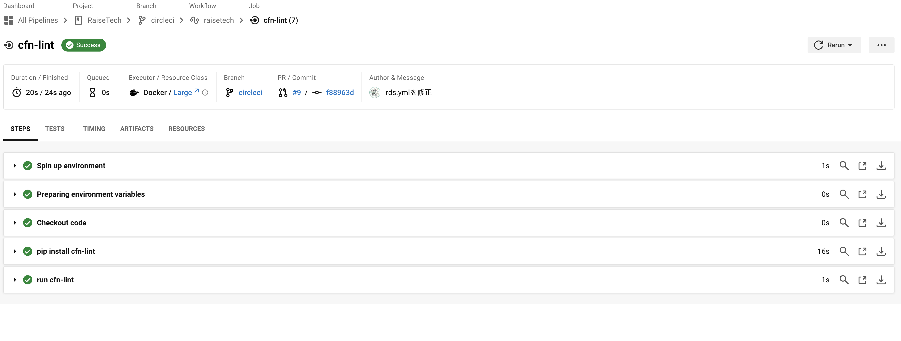

# 課題１２を報告

## CircleCIのサンプルコンフィグを自分のリポジトリに組み込む

まずは、CLIをインストールしました。

\`\`\`bash
brew install circleci
\`\`\`

次に、CircleCIの設定ファイルのバリデーションを行います。

\`\`\`bash
circleci config validate
\`\`\`

### エラーと対処

エラーとして表示された点は以下の2点です。

1. **rds.ymlにパスワードをそのまま記載していた**: これを修正しました。
2. **AvailabilityZoneがハードコードされていた**: これも修正しました。

以上の修正を行い、再度pushすることでエラーが解決されました！

以上です。

